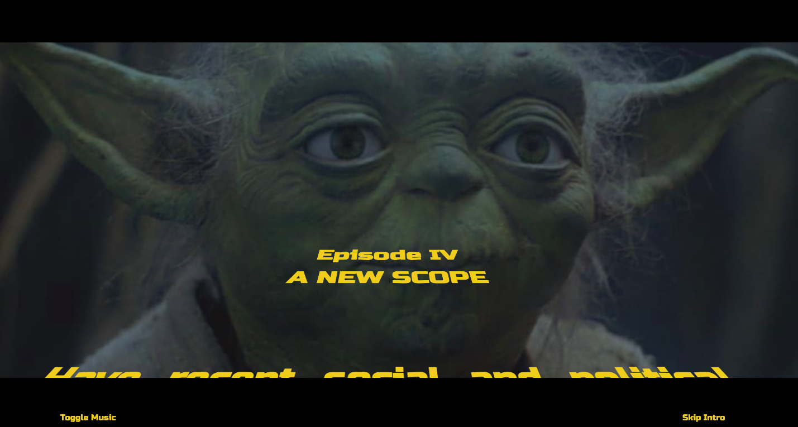
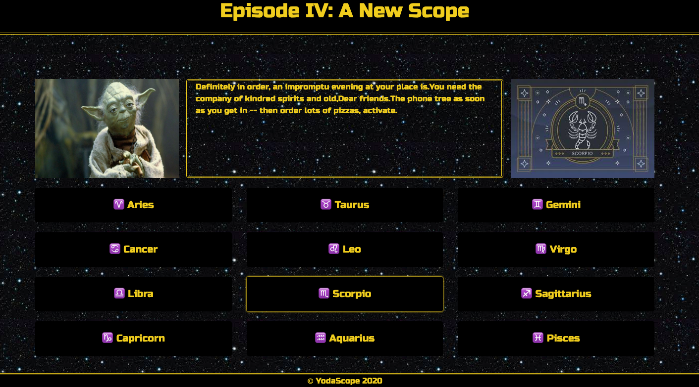

# The YodaScope - A Horoscope For Those In Need of A Higher Syntax

## Summary

Before discounting this project as financially frivolous or academically puerile, please note that it meaningfullyly combines a $9.3 billion franchise (Star Wars) with a $2.1 billion industry (astrology).

Millenials and baby boomers alike have taken an interest in the stars as esoteric guiding lights as they seek solace and security in a world that seems more ephemeral and temporary than ever before.

Furthermore, it has long been known that modern English syntax has been engineered to code and hide fundamental truths that can and should be conveyed through the spoken and written word. This mal-engineering has no doubt been the work of Webster and his affiliates, English teachers.

An alternative to this malicious and oppressive syntax was introduced to the public in 1980 when the Empire struck back, and Yoda helped turn our dear SkyWalker, Luke, from a boy into a man. Had Yoda simply said "do you judge me by my size" instead of "judge me by my size do you" Luke may never have lifted that starship out of the muck. And then be where, would we?

Our application, the YodaScope, unlocks the wisdom of western astrology using the syntax of the Yoda.

## Table of Contents

1. [Contributors](#contributors)
2. [Technologies](#technologies)
3. [Usage](#usage)
4. [License](#license)
5. [Contributing](#contributing)
6. [Questions](#questions)

## Contributors

<a href="https://github.com/nhodo" target="blank">Nathan hodo</a>
 
<a href="https://github.com/tldav" target="blank">Thomas Davis</a>
 
<a href="https://github.com/GeovonnieV" target="blank">Geovonnie Vasquez</a>

## Technologies

-   Languages

    -   JavaScript with jQuery

-   Third Party APIs

    -   RapidAPI
        -   Aztro
        -   Yodish

-   CSS Frameworks

    -   Bootstrap
    -   Tailwind CSS

-   Deployed using GitHub Pages

## Usage

To start, open index.html in the browser of your choice. No installation required.

Find the deployed application [here](https://tldav.github.io/yoda-horoscope/)

## License

[MIT](https://choosealicense.com/licenses/mit/)

## Contributing

If you would like to contribute to this project you can:

-   Either fork or clone this repo [here](https://github.com/tldav/yoda-horoscope)
-   Add any changes/upgrades you would like
-   Update the README with changes made, new technologies used, etc.
-   Create a new pull request [here](https://github.com/tldav/yoda-horoscope/compare)

## Questions

If you have questions about this application, please reach out to the creators via the email on their respective GitHub profiles, provided above.

