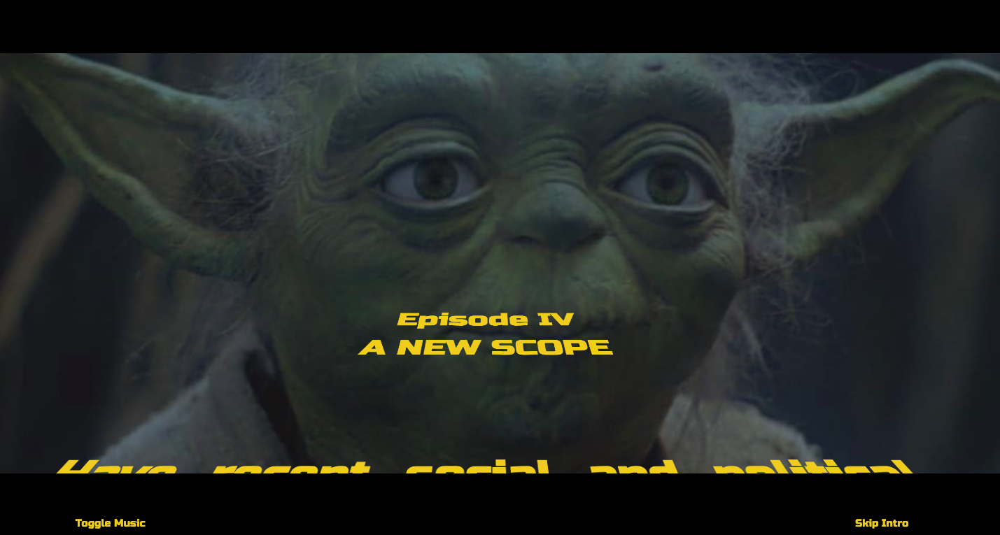

# The YodaScope - A Horoscope For Those In Need of A Higher Syntax

## User Story

AS I am a person concerned about my future who only speaks Yoda Speak
I WANT to be able to access a Western Horoscope in my native tongue
SO THAT I can know how to make good decisions based on the science of western astrology

GIVEN that I have access to the internet
WHEN I access the website
THEN I can input my birth sign and receive a western horoscope in yoda speak

## Summary

Before discounting this project as financially frivolous or academically puerile, please note that it meaningfullyly combines a $9.3 billion franchise (Star Wars) with a $2.1 billion industry (astrology).

Millenials and baby boomers alike have taken an interest in the stars as esoteric guiding lights as they seek solace and security in a world that seems more ephemeral and temporary than ever before.

Furthermore, it has long been known that modern English syntax has been engineered to code and hide fundamental truths that can and should be conveyed through the spoken and written word. This mal-engineering has no doubt been the work of Webster and his affiliates, English teachers.

An alternative to this malicious and oppressive syntax was introduced to the public in 1980 when the Empire struck back, and Yoda helped turn our dear SkyWalker, Luke, from a boy into a man. Had Yoda simply said "do you judge me by my size" instead of "judge me by my size do you" Luke may never have lifted that starship out of the muck. And then be where, would we?

Our application, the YodaScope, unlocks the wisdom of western astrology using the syntax of the Yoda.

## Application Specs

-   Two server-side APIs
    - RapidAPI
        - Aztro
        - Yodish

-   CSS Frameworks
    - Bootstrap
    - Tailwind

-   Interactive 
    - user selects his/her astrological sign

-   Polished UI

-   Quality coding standards

-   No alerts, confirms or prompts

-   Deployed to GitHub Pages

## Screenshots of Deployed Application

![Main Page] (assets/YodaScope ScreenShot2.png)

## Links to GitHub Repository and Deployed Application

[GitHub Repository](https://github.com/tldav/yoda-horoscope/)
[Deployed Application] (https://tldav.github.io/yoda-horoscope/)
